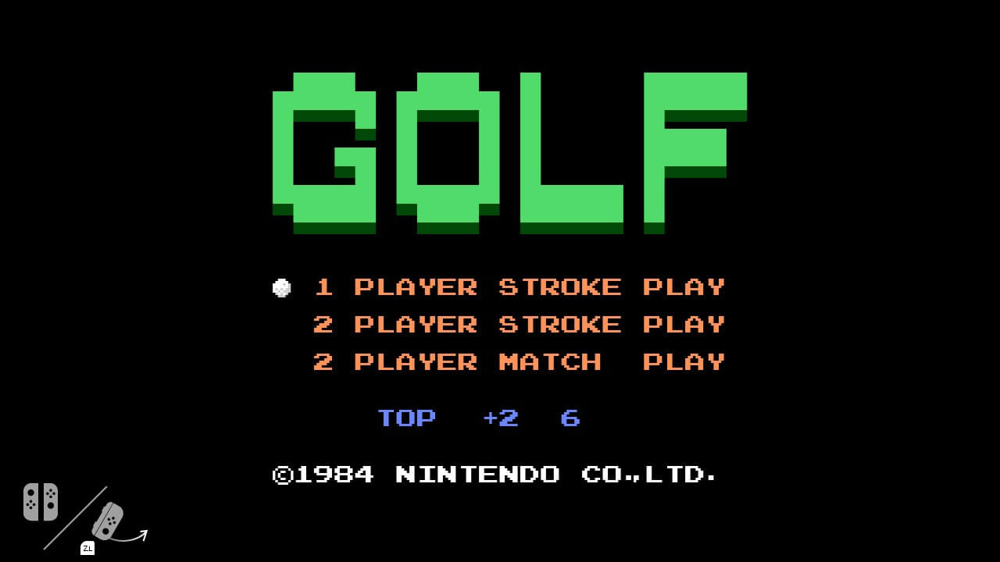
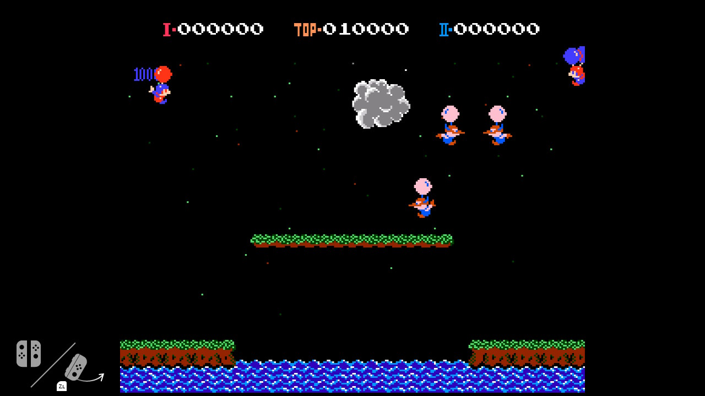

# flog

This repository is dedicated to flog, an easter egg present on Nintendo Switch consoles, containing various tools and information, which are the result of progressive reverse-engineering of the easter egg.

## The actual easter egg

> Screenshot of flog running

flog is/was an easter egg inside Nintendo Switch consoles. It's an application built-in the console's OS, which, under certain circumstances described [here](https://switchbrew.org/w/index.php?title=Flog), could be opened from the HOME menu.

As the name itself suggests (for anyone who didn't already notice, flog comes from golf), the easter egg application consists on a simple NES emulator which launhes the NES Golf game.

For anyone who would like to try it on their consoles... you currently can't, at least on recent firmware versions. While the application is still technically present on every firmware update along with all the other system processes and data archives, it is stubbed for firmware versions 4.0.0 or higher - the main executable(s) are filled with literal rubbish, they are not even valid executable files. Regardless, you can dump it from older, <4.0.0 firmware updates and play it.

## Technical information

Despite Nintendo Switch applications having the RomFs filesystem to place files (such as music or gfx resources), the Golf game consists on a hardcoded NES ROM in the code itself.

In fact, flog does have a non-empty RomFs, but the only present file is a single 0-byte file, interestingly named `AtLeastOneFile`.

Surprisingly, the ROM doesn't consist on just hardcoded regular NES ROM data, since this raw data has its own filesystem format

I refer to this filesystem as "KSD filesystem/KSD FS" on my work in this repo since several flog symbols show source files named as "ksd_<...>.cpp", but this name is made up.

Reversing the expected format of this embedded filesystem led to the following conclusions:

- The filesystem is designed for multiple files (which might sound quite redundant), but this means that flog may have been designed with the purpose of emulating multiple games. Regardless, the filesystem data embedded in the main executable only contains the Golf NES ROM.

- Regular NES ROMs, which follow the iNES format (more information about that [here](https://wiki.nesdev.com/w/index.php/INES)), have a 0x10-byte header. However, ROMs in this filesystem have a custom 0x20-byte header, whose structure has certain things in common with the iNES format header:

  - The iNES header starts with a 4-byte "NES*" magic, as usual with many binary formats. Regardless, the filesystem's ROM header stores the file data offset instead of a msgic in the first 4 bytes.

  - In the filesystem all headers are placed first, with each one storing their file's absolute offset as mentioned above. Then, after those headers, all the files are placed one after another, likely unaligned.

  - After the first 4 bytes, both headers store the PRG bank count and CHR bank count as two bytes, which is why this filesystem's ROM header format was likely inspired from the iNES one.

  - There is an unknown 16-bit value after the bytes mentioned above. The value seems related to mappers (TODO: find out its exact purpose), and setting it to zero with the Golf ROM makes flog crash after logging a "mapper 0xaa not yet" message.

 - Not all NES ROM types are supported. The full size of each ROM is computed as `prg_bank_count * 16KB + chr_bank_count * 8KB`, which means that games including Trainer data (0x200 bytes after the iNES header) are not supported, and those who have PlayChoice data after the PRG and CHR data should be added to the filesystem stripping that data (which is probably fine, since flog likely doesn't make use of that data)

 - For instance, the regular flog NES ROM is 0x8010/0x6010 bytes (depending on whether it has PlayChoice data), with those extra 0x10 bytes being the iNES header. The embedded filesystem in flog is 0x6020 bytes, which is essentially the normal/without-PlayChoice ROM, replacing the iNES header with the custom one.

 - Considering everything which has been already mentioned, the embedded filesystem was likely generated on compile-time and embedded as a byte array with `` or similar tools.

Since the filesystem is only for NES ROMs, other files flog uses but doesn't store in RomFs, like binary shader files (`*.bnsh`), are also embedded in the code, but directly, not in a filesystem format.

Internally, flog is a "system application", a special application kind within the Nintendo Switch. These are, essentially, applications which are not regular games. This is interesting since there are very few of this kind, with some examples being "starter" (the initial configuration UI the system uses on first launch) and other dev/Kiosk menus and tools.

## Python scripts

In fact, similar to what's mentioned above, the following [Python script](build_ksd_fs.py) in this repo, `build_ksd_fs.py`, can create a KSD filesystem from a directory containing regular NES ROMs. It can both generate a binary file or a C+ source file with the filesystem data, ready to be compiled with this repository's flog reimpl.

The other [Python script](replace_ksd_fs.py) in this repo, `replace_ksd_fs.py`, allows to replace the embedded filesystem in a flog `main` executable with a custom binary filesystem file. (Note that it currently only works with ROMs with the same size as flog)

> Example of the script's usage, having replaced Golf with Balloon Fight in flog

## Reimplementation

This repo's main project is in [flog](flog), which aims to be a reimplementation of flog itself by reverse-engineering its main executable.

In order to currently build it, you need to supply a path to the KSD filesystem to embed in the project, like `make KSD_FS=my_ksd_fs_dir`. Note that, in the future, you will also need to provide custom binary shader files in a similar way...